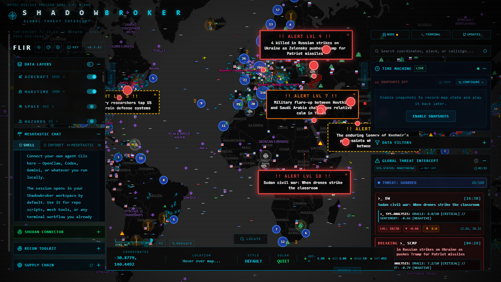

# ShadowBroker: come funziona dentro

Mappa dati e meccanismi. Per chi deve **modificare** ponte o
aggiungere strumenti. Per uso basta [14-agente-osint.md](14-agente-osint.md).

---

## Tre processi

```
:3000  frontend   Next.js 16 + MapLibre GL          npm run dev:frontend
:8000  backend    FastAPI + APScheduler             venv\Scripts\python.exe main.py
:4000  AIS locale opzionale, RTL-SDR                —
```

Browser parla **solo** con :3000. Frontend inoltra `/api/*` a :8000.
Niente Docker: setup nativo, CPU-only, non tocca GPU.

---

## Come arrivano i dati

APScheduler a due velocità:

```
veloce  ~60s    voli, navi, satelliti, SIGINT, CCTV, jamming GPS
lenta   min/ore GDELT, notizie, terremoti, mercati, correlazioni, Telegram
```

Tutto in dizionario in memoria (`services/fetchers/_store.py`,
`latest_data`) sotto lock. Niente database: **riavvio backend azzera
tutto**, layer si ripopolano in minuti.

---

## Le quattro forme dei dati

Punto che fa perdere tempo: stesso endpoint restituisce forme
diverse per layer.

| Forma | Layer | Come si legge |
|---|---|---|
| lista di dizionari | news, ships, trains, earthquakes | diretto |
| lista di Feature GeoJSON | **gdelt** | `properties` + `geometry.coordinates` |
| FeatureCollection unica | **frontlines** | un solo oggetto, migliaia di punti |
| oggetto singolo | threat_level, space_weather, gt_risk | non è lista |

`store._appiattisci()` normalizza tutte e quattro.

### Coordinate: quattro convenzioni

```
lat / lng            maggioranza
lat / lon            kiwisdr
coords: [lat, lng]   news, telegram_osint
geometry.coordinates GeoJSON -> (lng, lat)  ATTENZIONE: INVERTITO
```

Scambiare ordine GeoJSON manda risultati in mezzo all'oceano, senza
errore. `geo.coordinate_di()` le gestisce tutte.

---

## Dove finiscono i token

Misurato. Un campo per layer mangia quasi tutto:

| Layer | Campo | Quota |
|---|---|---|
| military_flights | `trail` (scia, array di punti) | **83,5%** |
| news | `summary` | 64% |
| frontlines | poligono | 100% |

Resto — sigla, tipo, posizione, quota, operatore, punteggi — 16%.
Sagome (`sagome.py`) tolgono primo, tengono secondo.

```
25 aerei grezzi        5.135 token
25 aerei con sagoma      780 token
```

---

## Testo notizie: non c'è

| Fonte | Titolo | Data | Corpo |
|---|---|---|---|
| news (RSS) | pulito | al minuto | **assente** |
| gdelt | dallo slug URL | `event_date` AAAAMMGG | campo c'è, **mai popolato** |
| telegram_osint | sì | sì | **sì** (pochi elementi) |

URL sempre presenti — fino a 10 per cluster GDELT. `testo.py` li tenta
in sequenza finché uno risponde. Paywall si saltano.

---

## Le classifiche già calcolate

Modello non deve inventare criteri di gravità.

| Cosa | Dove | Restituisce |
|---|---|---|
| `threat_level` | `oracle_service.py:199` | 0-100 + livello + motivi in inglese leggibile |
| `correlations` | layer | tipo, gravità, punteggio, `drivers` |
| `tracked_flights` | Plane-Alert, 16.077 velivoli | categoria, operatore, tag |
| GT analytics | `analytics/` | 1.641 regioni, probabilità per dominio, interpretazione |

### `threat_level`, sette pesi

```
0,25  sentimento negativo nelle notizie
0,25  mercati "CONFLICT"          <- VUOTI da noi: punteggio sottostimato
0,10  quota eventi ad alto rischio
0,10  punteggio oracolo massimo
0,10  anomalia militare (sopra 30 voli tracciati)
0,10  jamming GPS                  <- spesso vuoto
0,10  correlazioni fra layer
```

### GT: due variabili, non una

```powershell
$env:GT_ANALYTICS_ENABLED="true"
$env:GT_ANALYTICS_ACK_LOW_CPU="true"   # se profilo runtime e' "lean"
```

Dal `.env` **non funziona**: vanno passate al processo.

---

## Il canale agente

```
POST /api/ai/channel/command   {cmd, args}
POST /api/ai/channel/batch     fino a 20, concorrenti
GET  /api/ai/tools             catalogo (12.374 token: mai al modello)
GET  /api/ai/agent-actions     coda azioni per mappa, svuotata in lettura
```

**Su loopback niente firma.** HMAC serve solo ad agente su altra
macchina. `local`/`remote` nel pannello = **dove gira agente**, non che
modello usa. ShadowBroker non contiene nessun LLM.

### Livelli di permesso

```
READ_COMMANDS   letture
VIEW_COMMANDS   nostri: map_focus, set_layers, highlight   <- tier restricted
WRITE_COMMANDS  place_pin, inject_data, osint_sweep…       <- tier full
```

`VIEW_COMMANDS` categoria aggiunta da noi: cambia cosa
operatore *guarda*, non dati. Fra scritture avrebbe costretto
concedere anche iniezione dati e scansione attiva sottoreti solo per
spostare telecamera.

---

## Le trappole, tutte in un posto

| Trappola | Effetto | Rimedio |
|---|---|---|
| `get_telemetry` | **2.470.667 token** | bloccato nel client |
| `get_slow_telemetry` | 2.300.977 token | bloccato |
| `radius_km` / `radius_miles` | **ignorati in silenzio**, ricade su 500 miglia | usare `radius`, ricontrollare |
| `brief_area.context_layers` | primi N **mondiali**, non locali | usare solo `nearby` |
| `limit_per_layer` su frontlines | non lo tocca: 18.769 token | escluso |
| `alert_tags` | è **stringa**, non lista | `_tag_lista()` |
| `tracked_flights` | non è militare: c'è "Dogs with Jobs" | `_e_militare()` |
| rate limiter | 429 dopo ~20 richieste, senza `Retry-After` | pausa 120ms + backoff |
| processi orfani | uvicorn reload lascia figli in LISTEN | uccidere anche `multiprocessing.spawn` |
| proxy AIS | è Node, deps mai installate dal loro setup | `cd backend && npm install` |

Ultima è peggiore per debug: **Windows permette a più processi restare
in LISTEN sulla stessa porta**, quindi richieste possono finire al processo
vecchio senza segnale.

---

## Layer con dati, adesso

```
34.936 power_plants     1.553 gdelt          115 telegram_osint
12.783 sigint           1.468 private_flights  54 news
12.316 meshtastic       1.170 airports         40 weather_alerts
 5.434 commercial         798 kiwisdr          37 earthquakes
 5.000 firms_fires        646 military_bases   28 military_flights
 4.899 datacenters        492 satellites       11 ships (portaerei)
                          246 trains            9 internet_outages
                          177 tracked_flights   5 gt_risk / malware
```

**Vuoti (20):** air_quality, cctv, crowdthreat, fimi, financial,
fishing_activity, gps_jamming, liveuamap, oil, prediction_markets, sar_*,
scanners, stocks, uap_sightings, uavs, ukraine_alerts, viirs, volcanoes.

Alcuni per mancanza chiave, altri perché feed non produce nulla ora.
**Vanno dichiarati, non interpretati come "tutto tranquillo".**

---

## Chiavi API

In `shadowbroker/backend/.env`, ignorato da git.

| Chiave | Sblocca | Stato |
|---|---|---|
| `AIS_API_KEY` | 25.000 navi | **configurata** |
| `OPENSKY_CLIENT_ID/SECRET` | voli globali | **configurata** |
| `SH_CLIENT_ID/SECRET` | Sentinel Hub | mancante |
| `MESH_SAR_EARTHDATA_*` | anomalie SAR | mancante |
| `SHODAN_API_KEY` | dispositivi esposti | mancante |
| `GFW_API_TOKEN` | pesca | mancante |

---

## Interfaccia grafica



Da sinistra:

| Zona | Contenuto |
|---|---|
| pannello sinistro | **DATA LAYERS** — AIRCRAFT 1895, MARITIME 2000, SPACE 492, HAZARDS 65; sotto **Meshtastic Chat**, **Shodan Connector**, **Recon Toolkit**, **Supply Chain** |
| mappa | grappoli numerati, bandiere nazionalità, riquadri **ALERT LVL 1-10** sopra eventi |
| pannello destro | **TIME MACHINE**, **DATA FILTERS**, **GLOBAL THREAT INTERCEPT** con `THREAT: GUARDED 20/100` e notizie con `ORACLE: 8.0/10 [CRITICAL] // SENTIMENT: -0.66` |
| barra in basso | coordinate sotto puntatore, **STYLE** (DEFAULT/SATELLITE/FLIR/NVG/CRT), **SOLAR**, contatori live `ADS-B 1.9K · AIS 2.0K · NEWS 19 · SAT 492` |
| in alto a destra | **NODE** (mesh InfoNet), **TERMINAL** (CLI), **UPDATES**, ricerca coordinate/luogo/sigla |

Riquadro `THREAT: GUARDED 20/100` è stesso `threat_level`
che ponte legge: utente e modello vedono stesso numero.

### Catturare screenshot

Playwright funziona, ma serve **una riga di configurazione** o pagina resta
bloccata su "PRIORITIZING MAP FEEDS" per sempre. Vedi trappola sotto.

```python
from playwright.sync_api import sync_playwright
with sync_playwright() as p:
    b = p.chromium.launch(headless=False)
    pg = b.new_page(viewport={'width': 1600, 'height': 900})
    pg.goto('http://127.0.0.1:3000', wait_until='domcontentloaded')
    pg.wait_for_selector('.maplibregl-map canvas', timeout=90000)
    pg.screenshot(path='gui.png')
```

---

## La trappola più insidiosa: `allowedDevOrigins`

Next.js in sviluppo considera **`127.0.0.1` e `localhost` origini diverse**,
blocca risorse interne — font e WebSocket HMR — se pagina aperta con
forma "sbagliata". Chunk della mappa non arriva mai.

Sintomo crudele: pagina carica, intestazione e pannelli si
disegnano, resta scritto **"PRIORITIZING MAP FEEDS"** all'infinito. Nessun errore
in pagina, `window.maplibregl` semplicemente `undefined`. In console solo
`403 Forbidden` su `/__nextjs_font/...` e WebSocket HMR che fallisce — due
cose che sembrano innocue.

Riguarda **anche iframe di Odysseus**: indirizzo può essere una o altra
forma a seconda di come si è arrivati su Odysseus.

```ts
// frontend/next.config.ts
allowedDevOrigins: ['127.0.0.1', 'localhost'],
```

Persa tempo dando colpa a CDN tessere. WebGL funzionava (ANGLE su
GTX 1080), Playwright funzionava, canvas mancava perché **componente
mai montato**.

**Confermato dall'utente:** prima di questa correzione mappa dentro
pannello Odysseus **non caricava affatto**. Dopo, carica in 15-20 secondi.

### 15-20 secondi sono normali

`load` dell'iframe scatta quando arriva documento, ma MapLibre deve ancora
scaricare tessere e disegnare 45 livelli. Pannello lo dichiara
("carico la mappa…") invece di lasciare rettangolo nero che sembra rotto.
